It's hard to explain, but driving a car at night that has an auto dimming rear view mirror is a real treat. It's one of those things that you'll never notice when it's working, but as soon as you don't have it you'll notice its absence immediately.

My first car (a 99 Acura RL) had this feature and I loved it. I suppose it doesn't come as a surprise that the Cherokee which happens to be a brick on wheels was lacking it. Thankfully though rear view mirrors are easy to swap and a mirror out of a mid 2000s Chevy or GMC will bolt right up.

I ended up settling on a Gentex 177 (Gentex is the manufacturer who makes the mirrors for GM). On top of it being auto dimming, it also includes a display for outside air temp, and a compass. I bought the mirror as part of a complete kit from an Ebay seller which also included some wiring, and the outside air temp sensor. The mirror itself is used but it honestly looks brand new.

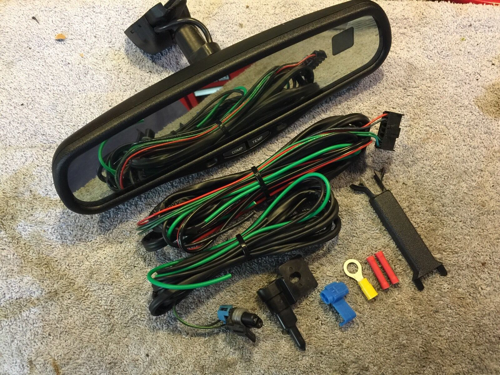

## Why Not an Overhead Console?

Part of the reason why I decided to swap the mirror was because I wanted an outside air temperature display, and a compass. Both of these features are built in to the fabled overhead console that some XJs came with, but I'm just not a fan of the overhead consoles.

Why? Mostly because I'm not a dude who likes to wear sun glasses, and the prices of overhead consoles seems to be steadily climbing each year as the amount of XJs in junkyards begins to dwindle. I felt the mirror was a much more financially reasonable decision.

**Note:** If you already have an overhead console installed this DIY will not work for you since it needs to use the same wires used by the overhead console.

## Preparing for Install

While bolting up the mirror itself is easy-peasy, this is a project that'll take you all day. In order to run the wires for the mirror you'll need to pull the headliner, and given that XJs are notorious for saggy headliners you'll probably be replacing the headliner fabric while you've got it out.

As luck would have it, every XJ came out of the factory with wires for the ambient air temperature sensor installed whether or not they had an overhead console. If you've ever looked beneath your front bumper and seen two wires dangling down, that's what they're for.

This is great because we won't have to drill a hole through the firewall and run additional wires. Instead we'll be connecting directly to the OEM wiring via a connector nearby the fuse box in the passenger foot well.

I'd recommend the following tools for the job.

### Tools

-   T15 torx screw driver
-   Small flat head screw driver
-   Phillips screw driver
-   Soldering iron + solder (could be substituted with crimp connectors)
-   Wire strippers
-   Pliers

**Note:** the tool list is not exhaustive as I'm not going to cover how to remove the headliner since there's already an abundance of great tutorials out there.

Here's a few supplies you should have handy as well.

### Supplies

-   Heat shrink
-   18 - 20 awg wire
-   Electrical tape
-   Zip ties
-   Oem Mopar connector C301, or (4) wire terminal pins\*\*

\*\*Depending on if your XJ has vanity lights in the visors (mine does), you may already have something plugged into the connector we'll be tapping into. If that's the case, all you'll need is some additional wire terminals as we can just push them into the open spots on the plug.

I've dug through both Mouser and Digikey with no luck trying to find terminals that would work. I ended up having to buy a pig tail for a random interior plug from a similar age Grand Cherokee so I could de-pin it.

These are the pin terminals I removed from the pigtail.
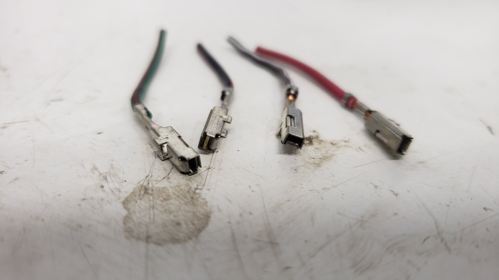

If your XJ has vanity lights in the visors your best bet is to buy a random white (the white ones all use the same pins) interior plug from a similar aged Cherokee or Grand Cherokee.

If your XJ doesn't already have this plug, I'd suggest hitting the junkyard and hoping to find one. If that fails, and you can't find one online you're probably going to want to just cut the original connector off and use an aftermarket one.

## Mount up the Mirror

The OEM mirror is only held in place by (1) T15 torx bolt. Unbolt it and the mirror should lift right off the mount.

Here's a side by side comparison for size reference. Gentex 177 on the left, OEM on the right
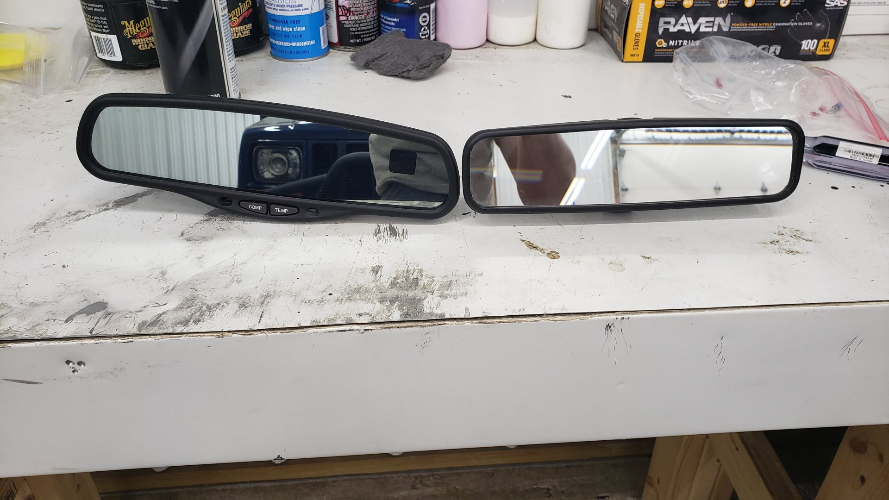

The Gentex 177 has a cover over the bolt that mounts it to the windshield so you'll need to remove it, but once that's done it's straight forward to install it.
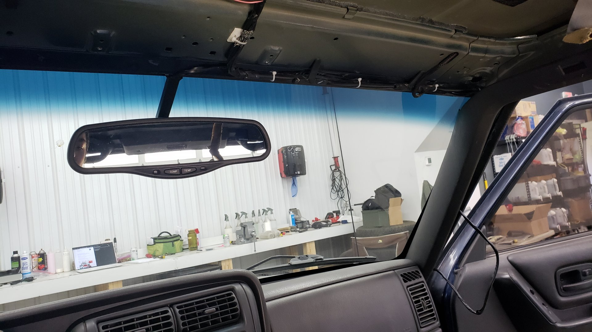

At this point you'll want to run the wires from the mirror up to the top of the windshield and then over to the passenger pillar. In the above picture the wire hanging down from the pillar is the new wire we need to get down by the fuse box.

I secured the new wires to the OEM dome light wiring via zip ties.

The kit I bought included a nifty wire cover to hide the wire going up the windshield.
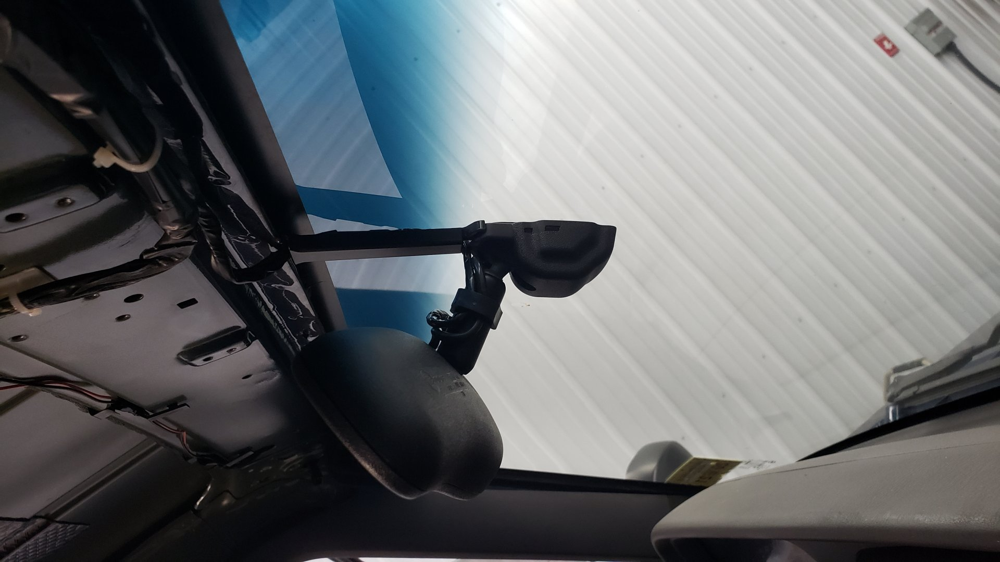

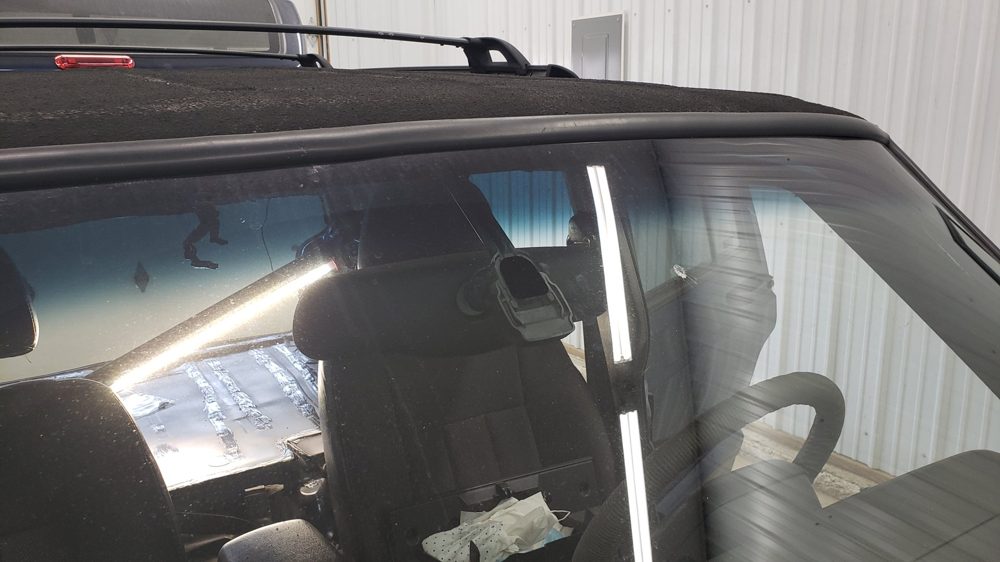

## Unbolt the Glove Box

To get at the connector we need to tap into, you'll need to remove the glove box. This can be done by removing the (3) Phillips screws from the bottom of the glove box and releasing the latch.

The connector we want is somewhere on the right behind the dash.
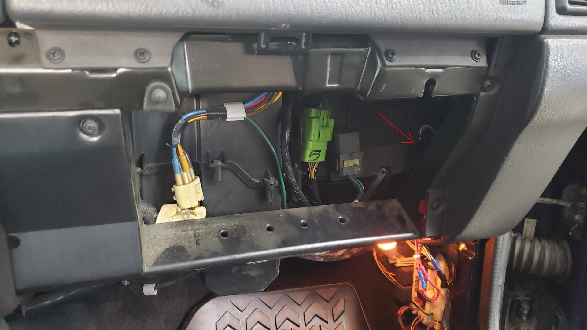

It's technical name is C301 and can be seen in the following diagram. If your XJ has vanity lights in the visors it'll have something already plugged into it.

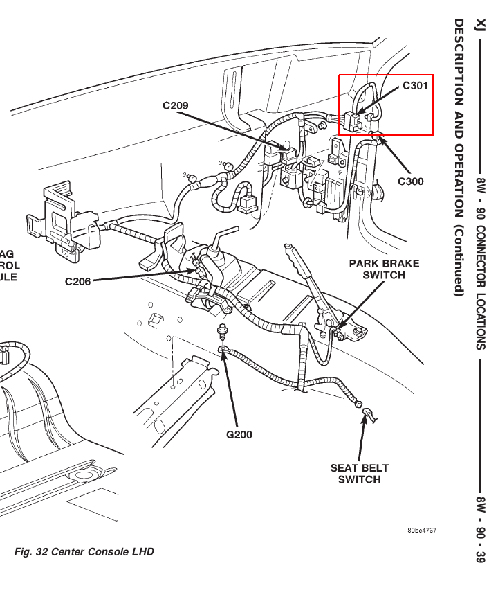

Here's what mine looks like. The colors of the wiring will vary depending on your model year. Mine's a 2000.
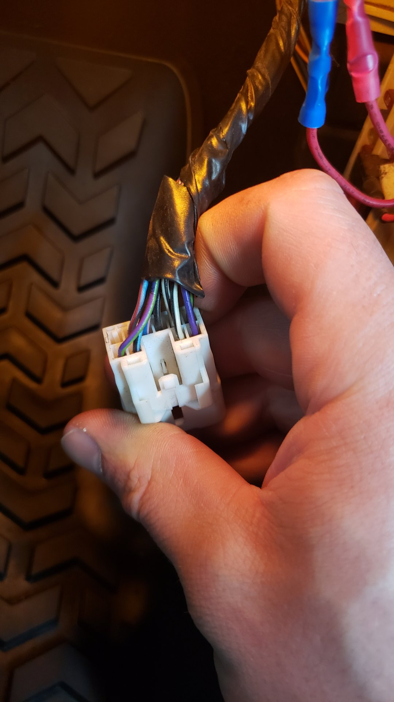

This is the plug that was connected to it. Note how it has fewer wires than the connector.

Please make sure to verify the pin-out of your connector based off the year as it might be different, but for mine (2000) it's as follows:
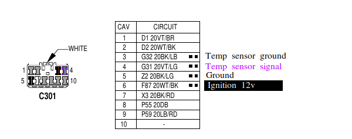

The wires with the two squares next to it are the 4 wires we'll be connecting to. The 4 wires we need are ignition 12v, ground, ambient temperature sensor signal, and ambient temperature sensor ground.

### Wires

-   F87 WT/BK -> White / black stripe: 12v when ignition is on
-   Z2 BK/LG -> Black / light green stripe: ground
-   G31 VT/LG -> Violet / light green stripe: ambient temperature sensor signal
-   G32 BK/LB -> Black / light brown stripe: ambient temperature sensor ground

At this point you'll want to carefully run the mirror wires down between the dash and pillar so they pop out by the glove box opening.

If your XJ has vanity lights in the visors like mine, go ahead and solder on the pins to each of the 4 wires coming from the mirror. Since the harness your using for the mirror likely isn't OEM you'll have to figure out which wire is which yourself.

If you had to buy the plug, or are using an aftermarket one, this is where you'd want to solder it on to the wires.

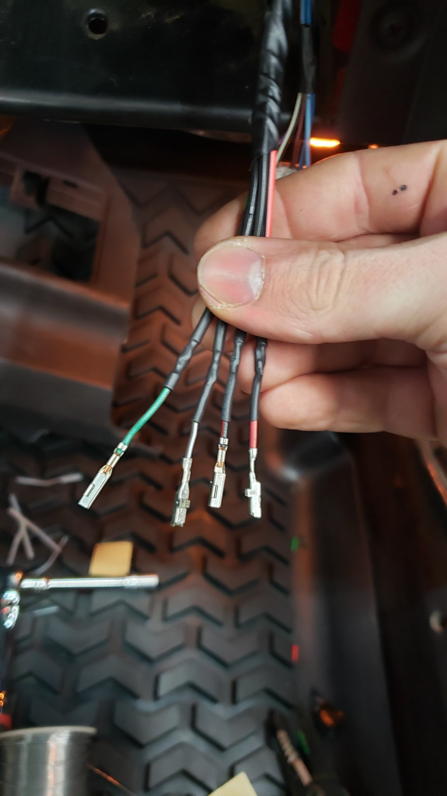

After that, go ahead and push them into the appropriate spots on the plug.
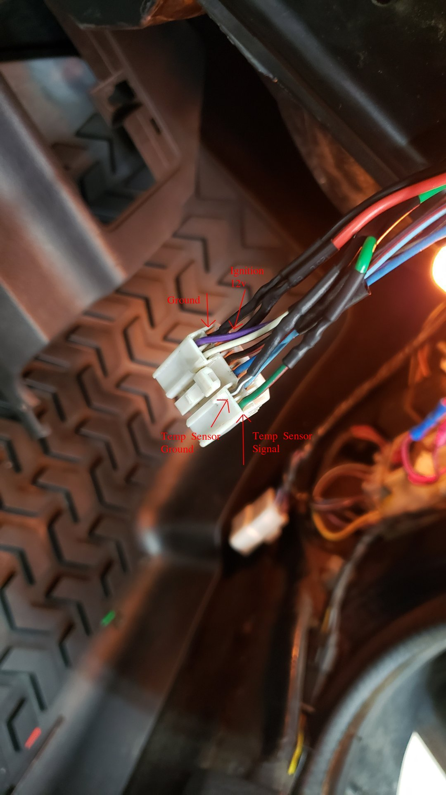

Once you've done that. Feel free to plug it back into the connector. If you pop the key in and turn it to ignition your mirror display should light up. The compass will work, but the temperature output will be gibberish since the sensor isn't connected yet.

Go ahead and reassemble your interior by re-installing the glove box. Next up we'll be wiring in the sensor.

(I'm assuming your headliner won't be ready for re-install yet since you're probably fixing it. But if it is, go ahead and put that back in too)

## Climb Under the Front Bumper

Hopefully you're working inside because for the remainder of this job you'll be laying on your back working underneath the bumper.

We're on the home stretch now as we just need to hook up the ambient air temperature sensor. To find the wires we need, look directly below the radiator and you should be able to spot two wires that don't actually connect to anything sitting on the crossmember.

I didn't snap a picture till after I mounted up the new sensor (I used a self tapper). I apologize it's blurry.
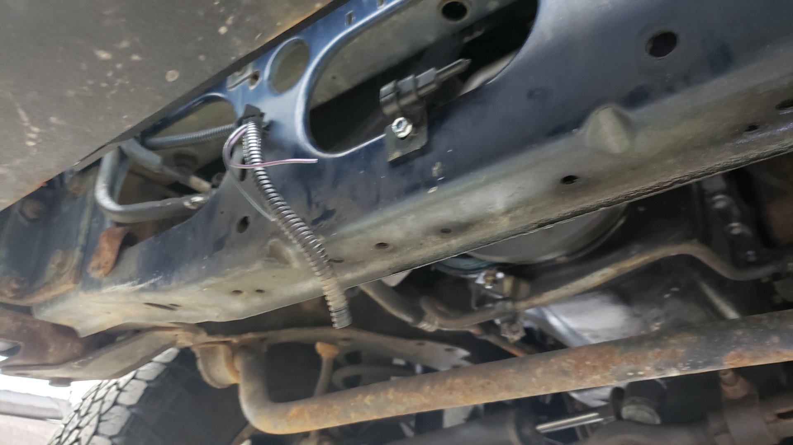

Since the colors of the wires will probably vary by year it'll be up to you to figure out which is the signal, and which is the ground. It's pretty safe to assume the ground will be black.

All you'll need to do at this point is solder up the new connector. I'd highly recommend you solder / heat shrink it unless you can pick up some water proof crimp connectors. This part of the wiring is going to be exposed to the elements so we want to make sure water can't get in and corrode our connections.
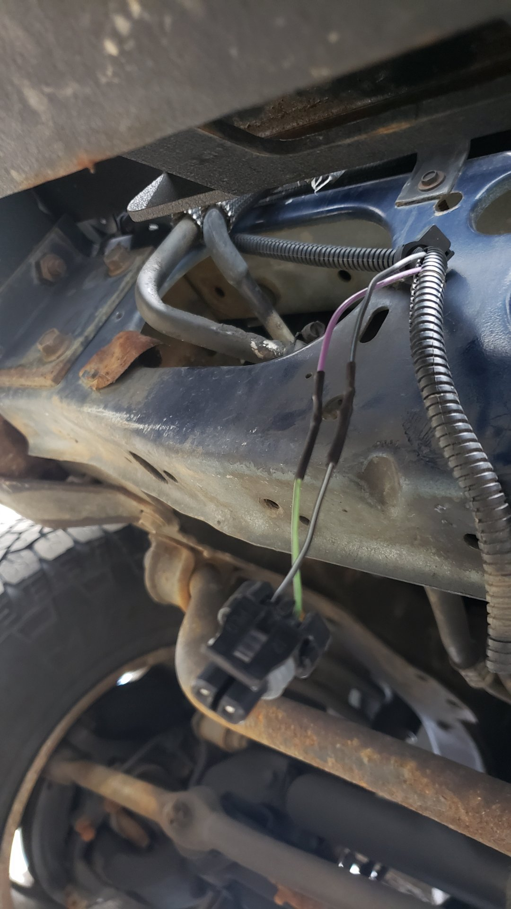

I ended up shortening the wires up a bit because I didn't want anything hanging down where you'd be able to see it.
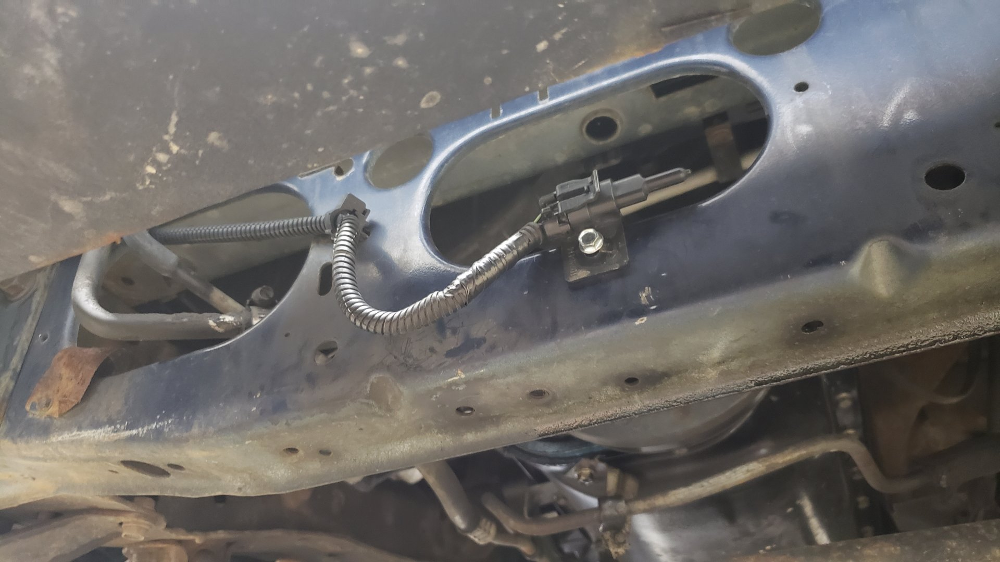

And just like that your done!

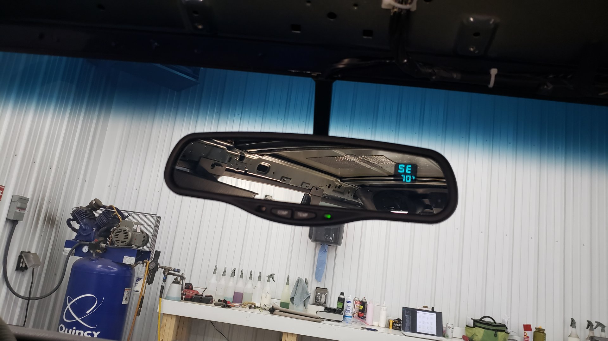

Close up of the mirror.
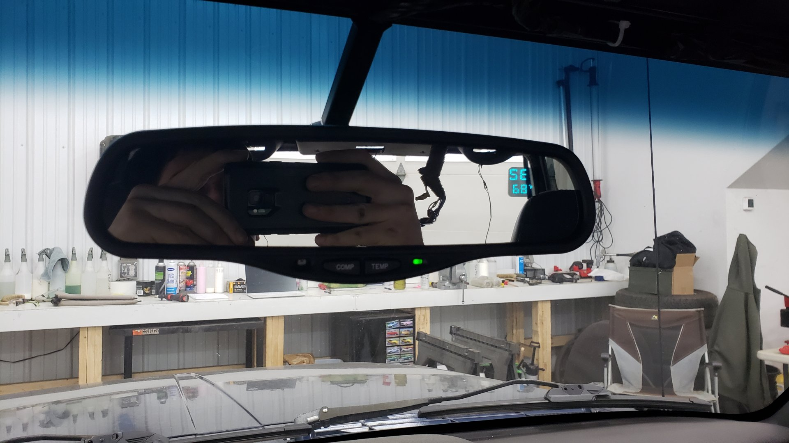

## Testing the Auto Dimming Feature

To test the auto dimming feature of the mirror you'll want to shine a light into the sensor to the left of the COMP button. Make sure it's dark out as the mirror won't dim unless it thinks it's night time. The direction and temperature display should also dim a bit when it switches to night mode.
