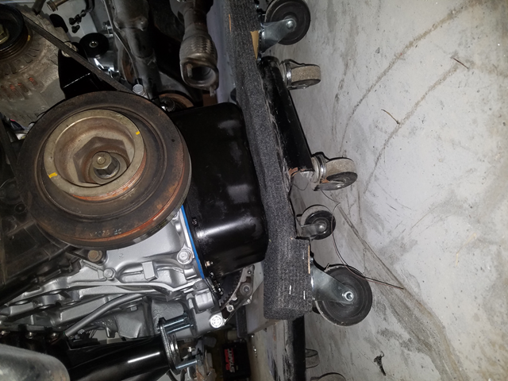
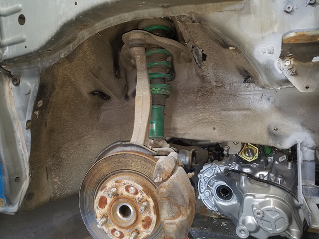
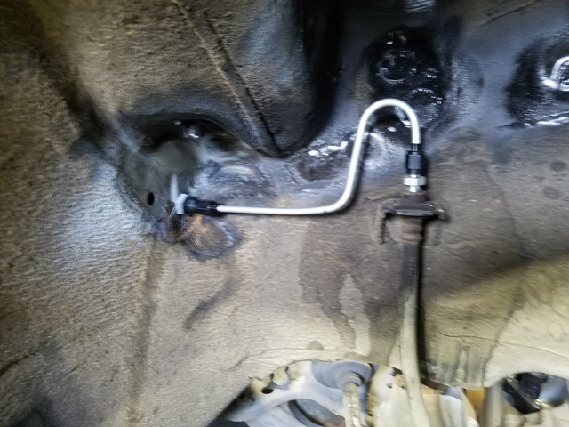
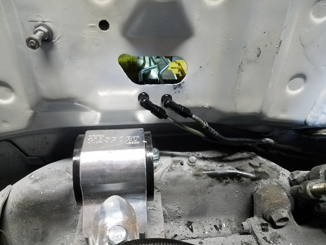
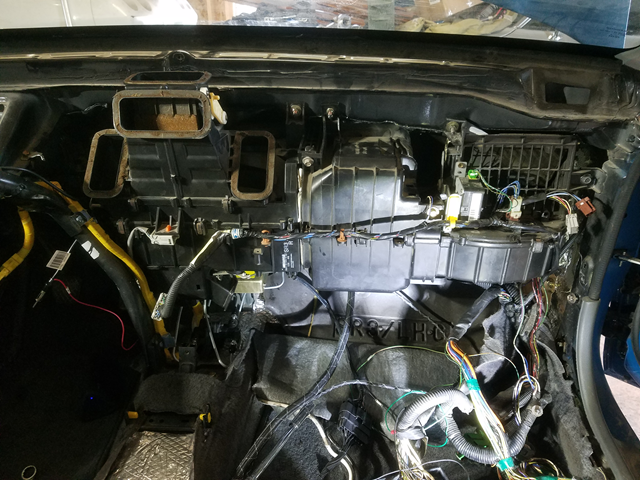
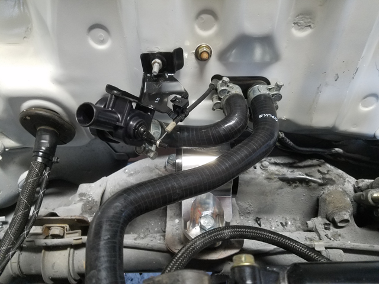
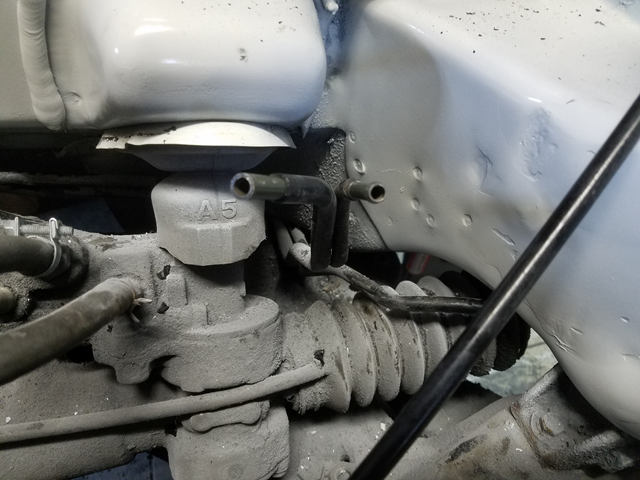
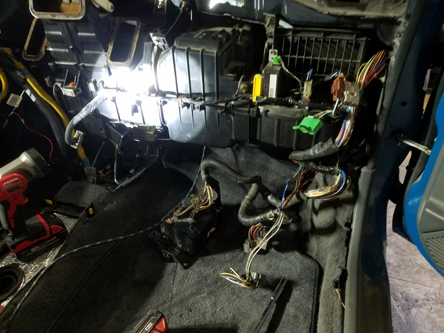
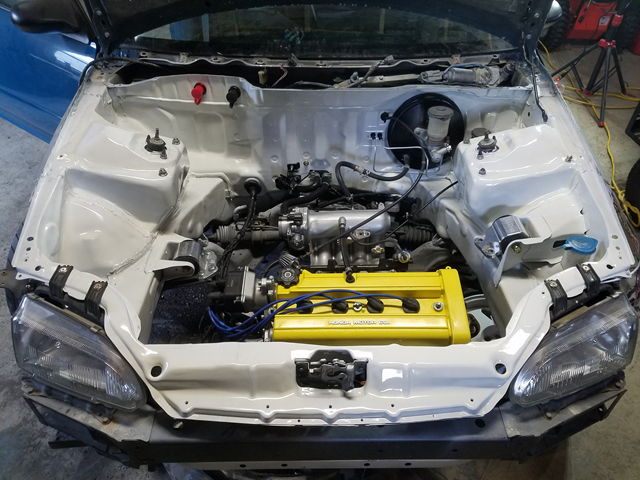
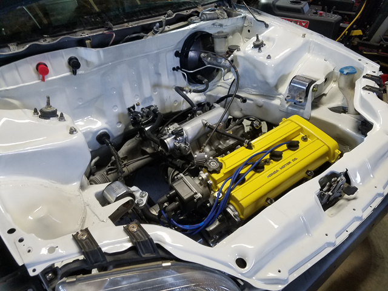

## Connecting the Pieces

It's easy to forget just how many parts you've removed until it comes time to put them all back together. I know I'm probably not alone when I say I've fallen victim to scope creep many times now. In the end you always tell yourself never again yet it keeps happening...

To help keep costs down I try to buy cheap things when I know they'll only be used temporarily. In this case I bought a Harbor Freight furniture dolley to support the motor / transmission. The sticker claimed it could support 1000lbs and while the wood felt cheap the cashier assured me they're tougher than they appear.

For the price they aren't bad, but sadly the dolly snapped today. Thankfully it wasn't a clean break and I was able to slip something underneath before the motor hit the ground.

Up here in Maine the roads have salt on them for almost 6 months out of the year. While this car doesn't see much snow, I didn't want the bare welds to start rusting so I spent some time on them today. Here's the passenger wheel well before starting.

To make working in there easier I pulled out the strut / spindle quickly. Then hit the welds with a wire wheel.

After that the welds were hit with some paint followed by rubberized undercoating. I meant to take a picture before moving on to the next step but I forgot. With the welds done I started running the new brake line for the passenger front caliper.

You may notive a second hole in the above picture. Let's just say the first location caused the line to rub with the wheel and that was far from ideal...

I also managed to get the two fittings that weren't hooking up properly to finally mate with their lines. I purposely placed these under the heater core hoses to hide them from view.

With those lines taken care of I was able to pop the heater core back in. I made sure every bolt / nut was holding it in place in hopes of reducing interior rattles.

Then I hooked up the heater core hoses + the new heater valve. The original valve never worked quite right after sand blasting it so I ended up splurging on a new oem one.

Figured it was time to finalize the fuel lines. The lines used were from a kit JB Tuned sells but honestly you should just cut out the main in the middle and buy directly from e85 Freaks. JB Tuned doesn't seem like that great of a company.

Cleaned up some of the wiring on the inside. Everything still visible will be hidden in the glove box.

I tried bending my lines for the master cylinder. They aren't perfect but I'm still pretty new to bending my own brake lines so I'm pretty happy with them.

Current bay status

First start should be next weekend!
