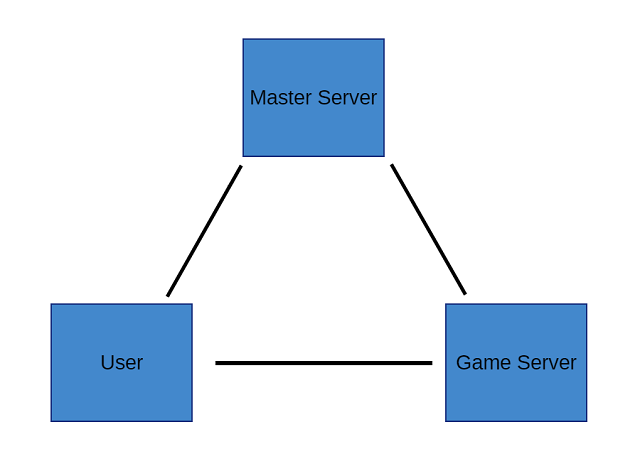
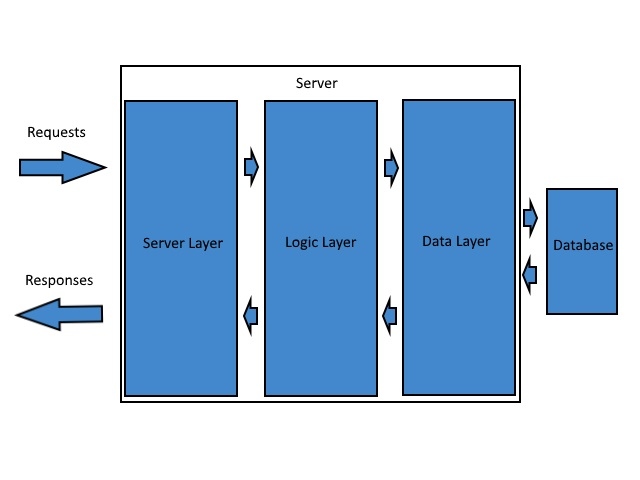

# Where I've Been, and Where I'm Heading

I took somewhat of an unplanned hiatus from working on No Mans Blocks. Initially, I took a break because I wanted to pursue writing a server for a Reddit clone. It wasn't until about two months in that I realized just how over scoped the project was and how long it would take to finish. While I may not have much to show for this time, it did open my eyes up to some of the common software-architecture patterns, and how to utilize these patterns to better organize my projects. During my adventure I also picked up TypeScript and dived into the intriguing world of NodeJS.

NodeJS was an interesting experience coming from C#. I never really understood async well until getting into Node, and let's just say it was a little rough getting started. Promises were another concept I had never dealt with before but honestly they can produce some elegant solutions. Typescript also helps keep one from entering the dreaded call back hell thanks to it's async and await features.

But anyways that enough rambling. I want to talk about the progress of No Mans Blocks. For anyone who is new to my blog, No Mans Blocks is a voxel first person shooter multiplayer game I've been working on in my spare time. It's built in Unity and uses a custom voxel engine I like to call Voxelated. My vision for this project is to develop a game akin to the Ace of Spades beta before Jagex took over.

## Network Set Up

These past two weeks I've been working on building a master server. The master server will be used as an account server, and used by game servers to validate users are who they claim to be. Game servers can be ran by anyone as the master server is only used to prevent malicious users from pretending to be someone they aren't. Here's a poorly drawn diagram of the network model.

Whenever a user first logs in the client will send a login request to the master server. The master server will then verify their credentials against the database and return back a json web token (JWT) and a unique login id if their username and password were valid. The values returned from the master server will be saved by the client for later on when they finally join a match. Game servers are responsible for running game matches. When a client wishes to join a match they will send their username and login id to the game server. The game server will then check with the master server to verify the client is who they claim to be. If the client is legitimate, the client is accepted, otherwise their kicked.

This set up protects the user's password from having to be sent to each game server. The JWT the client recieves will be stored in the config file of the game so they can re-login later on without having to re-enter their username and password each time. JWTs have a life span of 6 months, but will be continually rolling as each one will only be valid for one login. Passwords are salted and hashed before being stored in the database.

## The Master Server

Let's talk about the design details for those interested in software design. The tech stack of the master server is as follows:

- NodeJS
- MySQL
- Ubuntu

The master server follows the standard <a href="https://restfulapi.net/">REST principles</a>, and all interaction with the server are done via HTTP. To help out with handling HTTP requests the well known node module <a href="https://expressjs.com/">Express</a> is being used. For database interactions I'm using <a href="http://typeorm.io/">TypeORM</a>. I decided on TypeORM since it seemed more user friendly than Sequelize, and I haven't been dissapointed at all. I highly recommend it for anyone who needs a good ORM. I'm also taking advantage of TypeScript to help create a code base that will scale easier than plain JS. TypeScript is a nice addition to JavaScript and I do recommend it, but at the same time it's a leaky abstraction and unless your familiar with the quirks of JavaScript you might have some trouble working with it.

The master server is structured using the layered architecture pattern. The highest layer is the server layer which handles http requests and builds responses. In the middle is the business logic layer, and at the bottom is the data layer.

The server layer only handles incoming requests. It does not know any of the underlying logic, and simply redirects user requests to their corresponding logic handler. Once the business logic has finished it's job the server layer will build and return back a response to the request.

The business logic layer is where the real magic happens. This performs user validation, registration, or login requests. It also has the ability to send emails to confirm new user's emails, and more. All of the meat of the server lies here. The logic layer uses the data layer for data persistance.

Lastly is the data layer. This layer handles interacting with the database for basic CRUD (Create, Read, Update, Delete) operations with the database. It utilizes the repository pattern to offer storage places for various data models.

Currently the master server runs the database as well, and until this proves to be a bottleneck I'll keep it this way. The business logic layer, and data persistance layer are currently fully developed. I need to set up unit tests to weed out bugs in the logic layer. I'm currently trying to decide between using Jasmine or Jest for unit tests, and will report back with another update next Friday / Saturday. Stay tuned!
