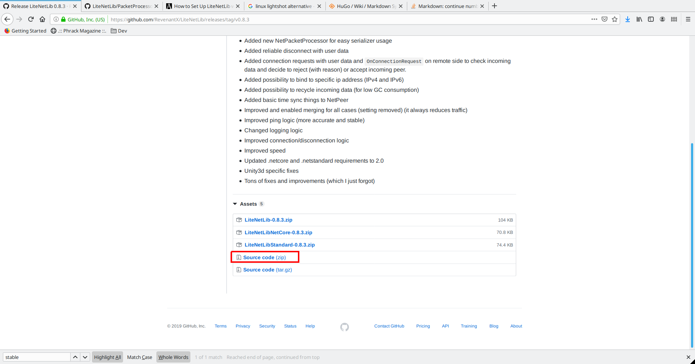
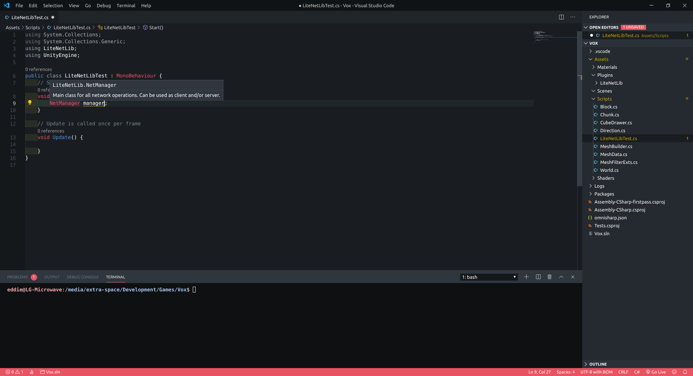

{}
**TL;DR** Download the most recent stable release source code zip and copy the `/LiteNetLib` folder to the `Plugins` folder in your Unity project.
{}

[LiteNetLib](https://github.com/RevenantX/LiteNetLib) is an UDP networking library that can be used for building multiplayer games with Unity. If you have any experience working with [Lidgren](https://github.com/lidgren/lidgren-network-gen3) you'll feel right at home with LiteNetLib. LiteNetLib is not Unity specific, but it's a popular choice.

# Create a `Plugins` Folder

Open up your Unity project. If you haven't already, create a `Plugins` folder directly under your `Assets` folder. The `Plugins` folder is one of several [special folders](https://docs.unity3d.com/Manual/SpecialFolders.html) Unity supports. `Plugins` is a bit of an odd name, but Unity will check here for any 3rd party libraries you may want to use. These can be in the form of DLLs, or raw source files (Unity will compile .cs files).

```
Assets
└───Scenes
└───Scripts
└───Plugins <-- Create This
```

# Download a Stable Release of LiteNetLib

Swing over to the [LiteNetLib GitHub repo](https://github.com/RevenantX/LiteNetLib). We need to navigate to the release page and find the most recent stable release.


At the time of writing this [0.8.3](https://github.com/RevenantX/LiteNetLib/releases/tag/v0.8.3) is the most recent stable release. Go ahead and download the source code zip, or tar.

{}
It's best not to use the DLL as there are some platform specific #ifdefs for Unity in the source code. That's why we extract
{}



# Extract `/LiteNetLib` to Your `Plugins` Folder

Once the download completes, extract the `LiteNetLib` folder from the zip into your `Plugins` folder. Your project directory should be as follows.

```
Assets
└───Scenes
└───Scripts
└───Plugins
│   └───LiteNetLib
```

Switch back into Unity, and it should pop up with a loading window as it processes the new files. Once complete, your project should now have LiteNetLib ready to use. Visual Studio, or VS Code will recognize LiteNetLib classes and Unity will be able to compile your project error free.



Have fun!
